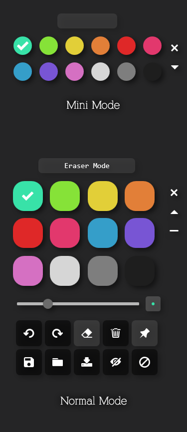
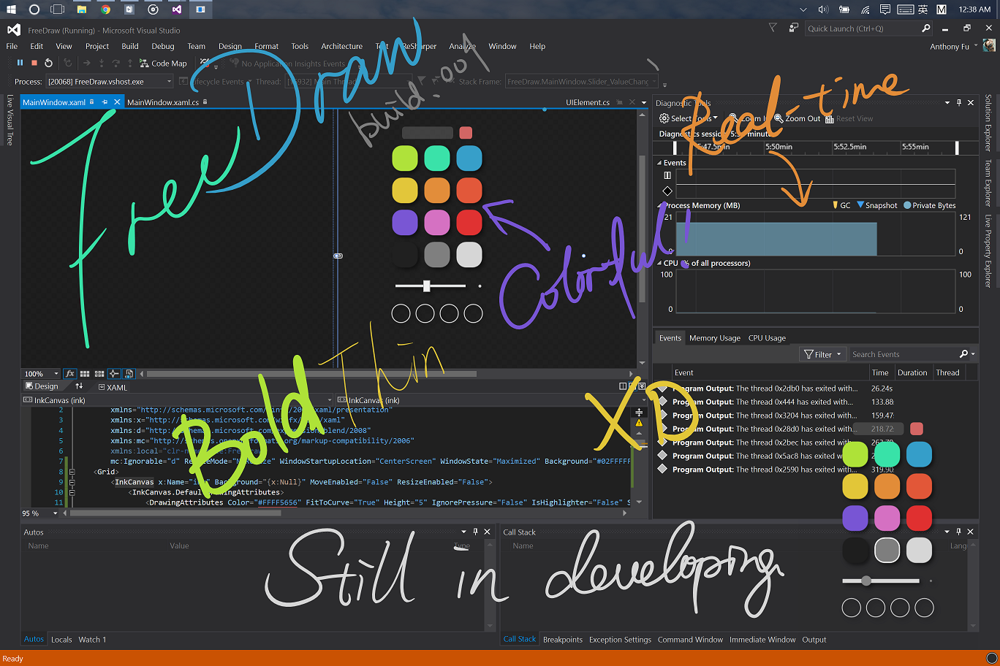
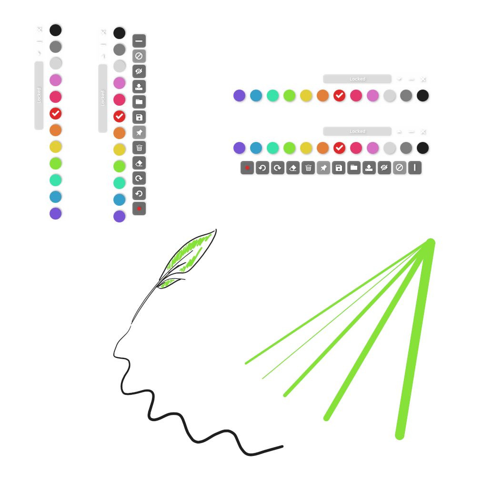

# LiveDraw
A tool allows you to draw on screen real-time.

## Why?
When you need to draw or mark something with presentation, you may use some tools like
[Windows Ink Workspace](https://blogs.windows.com/windowsexperience/2016/10/10/windows-10-tip-getting-started-with-the-windows-ink-workspace/),
but all of them are actually **taking a screenshot** and allowing you to draw on it.
That's actually annoying when you want to presentation something dynamic.

However, **LiveDraw is here and built for it!**

## Interface

## Usage
### Downloads
[Release](https://github.com/antfu/live-draw/releases)

### Features
- True transparent background (you can draw freely even when you are watching videos).
- Select colors by simply clicks.
- Adjust the size of brush.
- Draw ink with pressure (when using a pen with pen pressure).
- Auto smooth ink.
- Mini mode.
- Unlimited undo/redo.
- Freely drag the palette.
- Save and load ink to file (binary file) with color.
- Temporarily disable draw then you can be able to operate other windows.
- Fully animated.

## Todo
- Edge docking
- Export as image files
- Mouse penetration

## Publish
- dotnet publish -c Release -r win-x86 -p:PublishSingleFile=true
- dotnet publish -c Release -r win-x64 -p:PublishSingleFile=true

## License
MIT
